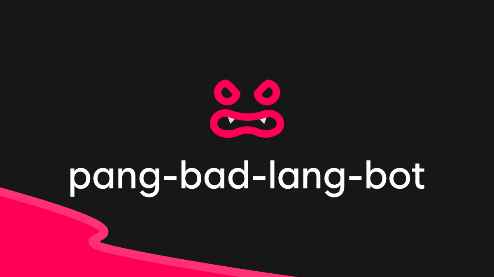

# pang-bad-lang-bot
> 한국어 기반의 욕설 감지 시스템 입니다

## 비속어 감지 (containsProfanity)
| 텍스트에 비속어가 포함되어 있는지 확인합니다.
```ts
// 결과: true 또는 false
containsProfanity("검사할 텍스트");
```

## 사용자 정의 패턴 추가 (addCustomPattern)
| 기본 비속어 패턴 외에 사용자 정의 정규식 패턴을 추가할 수 있습니다.
```ts
addCustomPattern(/(김|신).{0,10}(규|윤)/);
```

## 비속어 찾기 (findProfanities)
| 텍스트에서 발견된 모든 비속어를 배열로 반환합니다.
```ts
// 결과: ["검사할", "검", "할"]
findProfanities("검사할 텍스트");
```

## 비속어 대체 (replaceProfanity)
| 텍스트에서 비속어를 발견하면 지정된 문구로 대체합니다.
```ts
// 기본 대체 문구 사용
replaceProfanity("비속어가 포함된 텍스트");
// 결과: "클린봇에 의해 검열되었습니다."

// 사용자 정의 대체 문구 사용
replaceProfanity("비속어가 포함된 텍스트", "감지 되었습니다.");
// 결과: "감지 되었습니다."
```

# 기여하기
> 곧 이슈 템플릿 및 PR 템플릿이 추가될 예정입니다!

모든 개발자 분들의 기여를 환영 합니다.


